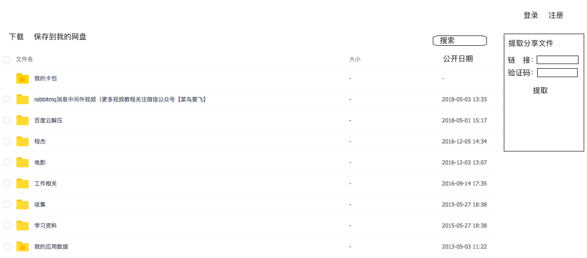
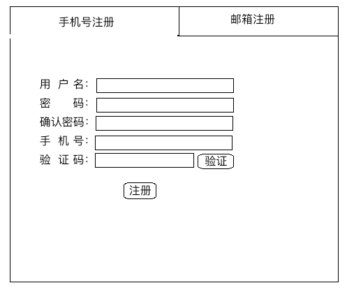
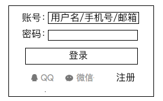
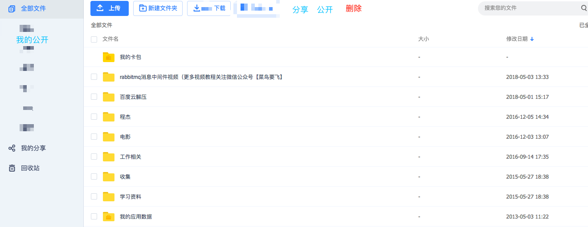
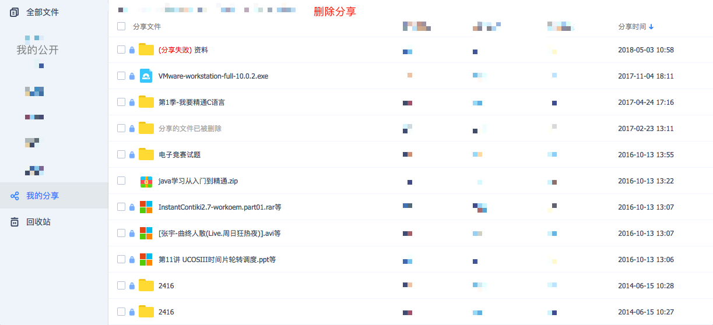
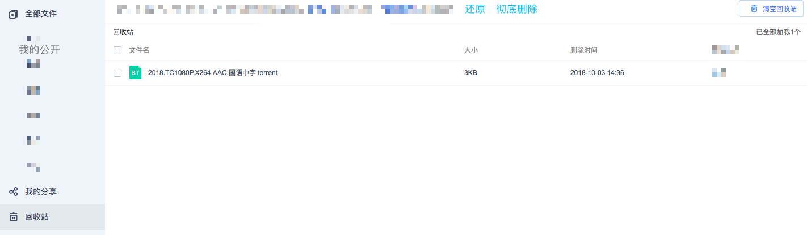
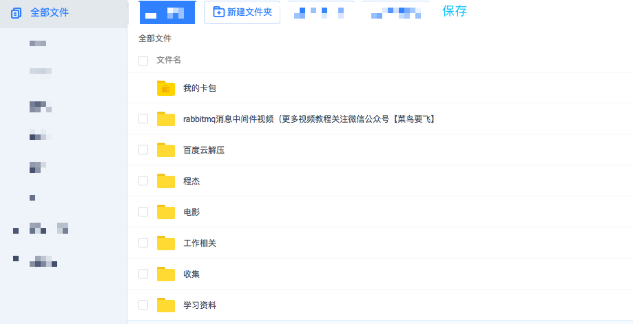
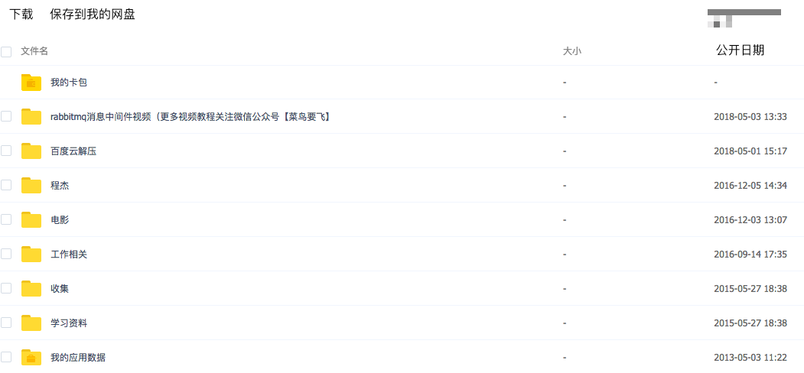

# 云盘

## 需求

+ 概述

  本次要做的是个网盘系统，用户可以进行注册，登录，进入系统后可以新建文件夹，上传文件，下载文件，为自己的文件设置访问权限（私密、公开），也可以将文件生成分享链接

  未登录用户可以查看到公开的文件，或者根据分享链接下载文件

  登录用户可以查看公开文件，根据分享链接下载文件，或将这些文件保存到自己的网盘

+ 首页

  + 显示公开的所有文件（按公开时间排序），不对文件进行分类（暂定），每个文件提供1个复选框，通过复选框选择文件后点击`下载`或`保存到我的网盘（仅对登录用户）`对文件进行对应的操作

  + 提供搜索

  + 提供分享文件提取选项卡

  + 提供登录、注册入口，登陆后显示为用户头像，点开头像显示为菜单：个人中心、我的网盘、退出

     

+ 注册

  + 注册系统两种注册方式：邮箱注册、手机号注册，分别为2个注册选项卡

    每个注册选项卡有5个必填项：

    + 用户名（全局唯一，设置后不可更改）

    + 密码（6-20字符，只能包含数字、字母、标点符号，除空格）

    + 确认密码

    + 邮箱/手机号（全局唯一）

    + 验证码（右侧有1个验证按钮，点击后将对手机号、邮箱发送验证邮件，收到的验证码填到该栏，90秒验证时间）

       

  + 注册后自动登录，跳转到首页

+ 登录

  + 提供`用户名/手机号/邮箱`+`密码`登录，qq、微信授权登录

  + qq、微信登录时，如果是未注册用户，跳转到注册页面进行注册，注册成功后自动绑定qq或微信

  + 登录页面提供注册页面跳转链接

     

+ 个人中心

  + 提供2个选项卡：个人资料、绑定账号

  + 个人资料

    在这里可以修改头像；改绑/设置手机号、邮箱；注销账号

  + 提供qq、微信账号绑定

+ 我的网盘

  > 该页面共4个选项卡：全部文件、我的分享、我的公开、回收站

  + 全部文件

    最上面选项：上传、下载、新建文件夹、分享、公开、删除

    右侧有个搜索框

    下面是文件列表，共3列：文件名、大小、修改日期

    每个文件前面有个复选框

     

  + 我的分享

     

  + 我的公开

    与我的分享页面完全一致

  + 回收站

     

+ 保存到我的网盘

  点击保存到我的网盘后，跳转到如下页面

   

+ 提取分享文件

  > 输入完提取码后，如果可以正常提取，则展示如下界面

   

+ 后端注意事项

  + 1个文件可以被多个用户保存到自己的网盘，当1个文件被最后1个用户删除后，该文件从后台中进行真正的删除
